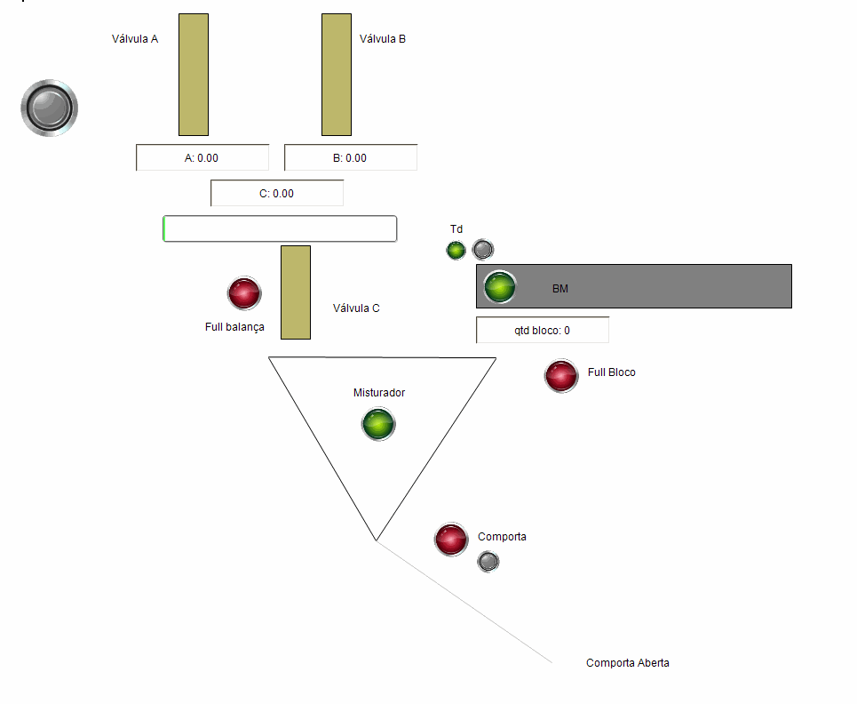

## Lista de exercícios na linguagem ST:

### Problema 1:

* Seletora de peças: Certa empresa precisa fazer a programação de um novo equipamento adquirido. A máquina é uma seletora de peças e sua programação funciona da seguinte forma: Ao pressionar o botão de start uma peça cai no meio da esteira; após 2 segundos, para estabilizar a peça, os sensores S4 e S3 verificam a altura da mesma e a separa entre altas e baixas. Quando a peça passar pelo sensor da caixa apropriado o ciclo finaliza e a esteira para, dando condição para um novo ciclo. A lâmpada liga enquanto o ciclo estiver em funcionamento e o botão stop finaliza o ciclo.


#### Variáveis:

```sql
PROGRAM PLC_PRG
VAR
    b1 : BOOL := FALSE;
    b2 : BOOL;
    m1_r : BOOL;
    m1_l : BOOL;

    qt_good : INT;
    qt_bad : INT;
    temp : TIME;

    s1 : BOOL;
    s2 : BOOL;
    s3 : BOOL;
    s4 : BOOL;

    lamp : BOOL;
    on_sensor : BOOL;
    timer : TON;

END_VAR
```

#### Código do programa:

```sql
timer(IN := b1, PT := T#2S);
IF b1 THEN 
    lamp := FALSE;
    temp := timer.ET;
    on_sensor := timer.Q;

    IF on_sensor THEN        
        IF s4 AND s3 THEN
            m1_r := TRUE; 
        END_IF    
        IF NOT s4 AND s3 THEN
            m1_l := TRUE;
        END_IF
    END_IF

    IF m1_r THEN 
        IF s2 THEN
            m1_r := FALSE; 
            lamp := TRUE;
            b1 := FALSE;
            qt_good := qt_good + 1;
        END_IF
    END_IF

    IF m1_l THEN
        IF s1 THEN
            m1_l := FALSE;
            lamp := TRUE;
            b1 := FALSE;
            qt_bad := qt_bad + 1;
        END_IF
    END_IF

END_IF
IF b2 THEN
    b1 := FALSE;
END_IF
```

#### Simulação visual:


### Problema 2:

* Pasteurizadora: Uma empresa quer fazer a programação de um novo equipamento adquirido, uma máquina pasteurizadora, e sua programação funciona da seguinte forma: Ao ser pressionado o botão de start a esteira aguarda existir uma peça no sensor S1 para então ligar. Quando a peça chegar ao sensor S2, a esteira para e então é feito o aquecimento da peça durante 3 segundos. A esteira liga e a peça é conduzida até o sensor S3 onde a esteira para novamente e ocorre o processo de resfriamento durante 2 segundos. Em seguida a esteira liga até que a peça caia na caixa, passando pelo sensor S4 finalizando e dando condições para um novo ciclo. A lâmpada liga enquanto o ciclo estiver em funcionamento e o botão de stop finaliza o processo.


#### Variáveis:

```sql
PROGRAM PLC_PRG
VAR

b1 : BOOL;
b2 : BOOL;

s1 : BOOL;
s2 : BOOL;
s3 : BOOL;
s4 : BOOL;

timer_r1 : TON;
timer_v1 : TON;
m1 : BOOL;

counter : INT;

END_VAR
```

#### Código do programa:

```sql
IF b1 THEN
    IF s1 THEN
        m1 := TRUE;
    END_IF

    IF s2 THEN
        m1 := FALSE;
    END_IF

    IF timer_r1.Q THEN
        m1 := TRUE;
    END_IF

    IF s3 THEN
        m1 := FALSE;
    END_IF            

    IF timer_v1.Q THEN
        m1 := TRUE;
    END_IF

    IF s4 THEN 
        counter := counter + 1;
        b1 := FALSE;
        m1 := FALSE;
    END_IF

END_IF

IF b2 THEN
    b1 := FALSE;
    m1 := FALSE;
END_IF


timer_r1(IN:=s2, PT:=T#3S);
timer_v1(IN:=s3, PT:=T#2S);
```

### Simulação Visual:


### Problema 3:

* Esteira separadora de peças: Em um sistema de produção são produzidas caixas de dois tamanhos diferentes. Os dois modelos de caixas são colocados em uma mesma esteira para transporte dentro da fábrica. Além de transportar, esta esteira tem como função verificar o modelo de caixa, grande ou pequena, e destiná-las para o caminho correto.

* Deverá haver uma botoeira para ligar e uma botoeira para desligar a esteira;Um sensor fotoelétrico verifica, através de tempo, o tamanho da caixa (1 segundo caixa pequena; 3 segundos - caixa grande);

* Caixa pequena: O processo continua normalmente;

* Caixa grande: A esteira deverá desacelerar em 1,5 segundos para 25% da velocidade atual;

* Após a desaceleração, através do cilindro pneumático, a caixa deverá ser deslocada para uma rampa lateral;

* Após o deslocamento da caixa, a esteira deverá acelerar novamente até atingir a velocidade normal.


#### Variáveis:

```sql
PROGRAM PLC_PRG
VAR
    b1 : BOOL;

    m1 : BOOL;
    m1_vel : INT := 100;

    temp_p : TON;
    temp_g : TON;

    desacel : BOOL;    
    pistao : BOOL;

    s1 : BOOL;

    temp_pistao: TON;
    s_pistao_rc: BOOL;
END_VAR
```

#### Código do programa:

```sql
IF b1 THEN
    m1 := TRUE;
    s_pistao_rc := TRUE;

    IF temp_g.Q THEN
        m1_vel := 25;
        pistao := TRUE;
        desacel := TRUE;
    END_IF

    IF temp_pistao.Q THEN
        m1_vel := 100;
        pistao := FALSE;
        s_pistao_rc := TRUE;
        desacel := FALSE;
    END_IF

END_IF

IF NOT b1 THEN 
    m1 := FALSE;
END_IF

temp_p(IN := s1, PT:= T#1S);
temp_g(IN := s1, PT:= T#3S); 
temp_pistao(IN := desacel, PT:= T#1.5S); 
```

### Simulação visual:


### Problema 4:

* Esteira Empacotadora: Em um sistema de produção, peças produzidas devem ser colocadas dentro de caixas em uma quantidade pré-determinada. Para automatizar o sistema, é utilizada uma esteira para transporte das peças, e uma esteira para transporte das caixas. 

* Deverá haver uma botoeira para ligar e uma botoeira para desligar as esteiras;

* Ao ligar as esteiras, a caixa deverá ser deslocada até o sensor de posição;

* Após a caixa estar posicionada, a esteira de peças deverá ser automaticamente ligada e a de caixas desligada;

* Após a esteira de peças ligada, a caixa posicionada deverá receber seis peças contadas através do sensor localizado ao final da esteira;

* Após a caixa receber as seis peças, automaticamente a esteira de peças deverá ser desligada e a esteira de caixas ligada;

* Depois de ligada a esteira, a caixa deverá ser deslocada até o sensor de posição reiniciando o ciclo.


#### Variáveis

```sql
PROGRAM PLC_PRG
VAR
    b1 : BOOL;
    b2 : BOOL;

    m1 : BOOL;
    m2 : BOOL;

    s1 : BOOL;
    s2 : BOOL;

    temp : TON;
    t : BOOL;

    qtd : INT;
END_VAR
```

#### Código do programa:

```sql
IF b1 THEN
    m1 := TRUE;

    IF s1 THEN
        qtd := qtd + 1;
        s1 := FALSE;
    END_IF

    IF qtd >= 6 THEN
        t := TRUE;
        m2 := TRUE;
    END_IF

    IF m2 AND s2 AND temp.Q THEN
        m2 := FALSE;
        qtd := 0;
        t := FALSE;
    END_IF

END_IF

IF b2 THEN 
    m1 := FALSE;
    qtd := 0;
END_IF

temp(IN := t, PT := T#3S); 
```

### Simulação Visual:


### Problema 5:

* Os produtos A e B são pesados em uma balança C e blocos solúveis são trazidos um a um por uma esteira e colocados em um misturador N. O sistema automático descrito em seguida possibilita a obtenção da mistura desses três componentes.

* O produto A deve ser fornecido até que atinja o valor a (100 Kg) da balança C e então é preciso dosar o produto B até o valor b (200 Kg). Em seguida deve-se esvaziar a balança C (até atingir o valor z), enviando o produto para o misturador N.

* A esteira que transporta os blocos é comandada pelo motor BM, enquanto a quantidade de blocos que passa é detectada por um sensor de proximidade TD.

* Após a chegada de cinco blocos e dos produtos A e B da balança, inicia-se o processo de mistura dos produtos pelo acionamento do motor do misturador MR. Aguardam-se 20 segundos e, transcorrido esse tempo, começa a descarga do misturador.

* O motor de rotação do misturador é desligado somente quando a comporta estiver completamente abaixada. Após a descarga do misturador, a comporta deve retornar à posição inicial para que um novo ciclo possa ser iniciado.


#### Variáveis:

```sql
PROGRAM PLC_PRG
VAR
    a : REAL;
    b : REAL;
    c : REAL;

    qtd_bloco : INT;
    timer_misturador : TON;

    b1 : BOOL;
    full: BOOL := FALSE;
    bm: BOOL;
    td: BOOL;
    full_blocos: BOOL;

    comporta : BOOL;
END_VAR
```

#### Código do programa:

```sql
PROGRAM PLC_PRG
VAR
    a : REAL;
    b : REAL;
    c : REAL;

    qtd_bloco : INT;
    timer_misturador : TON;

    b1 : BOOL;
    full: BOOL := FALSE;
    bm: BOOL;
    td: BOOL;
    full_blocos: BOOL;

    comporta : BOOL;
END_VAR
```

## Simulação Visual:


